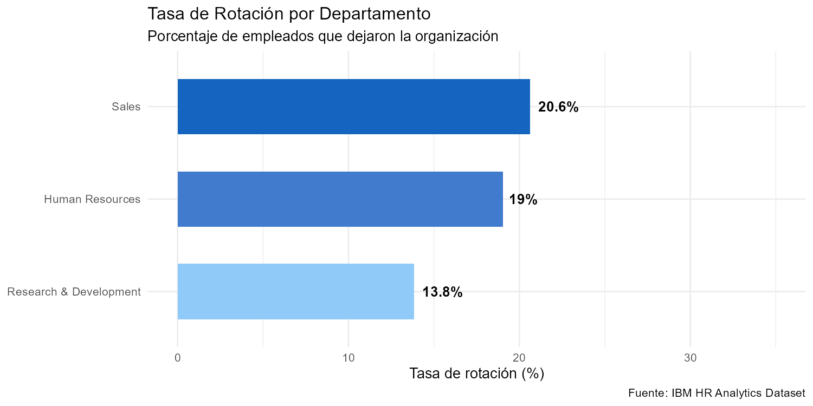
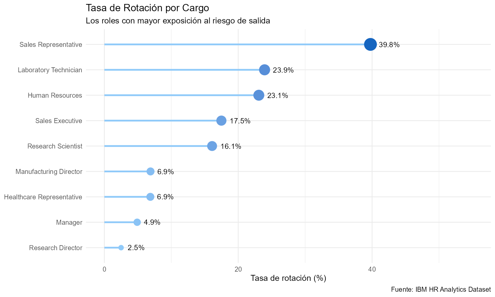
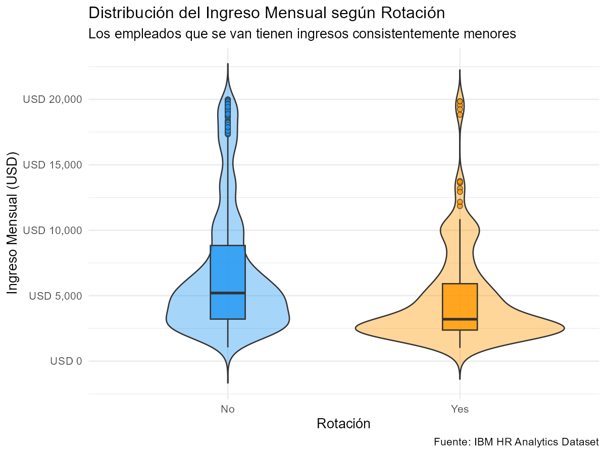
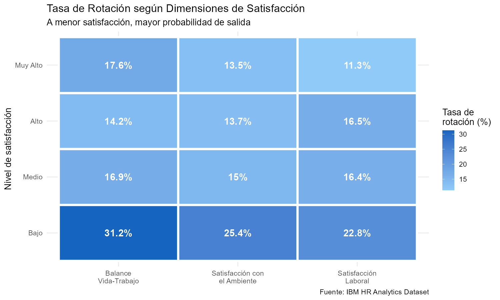
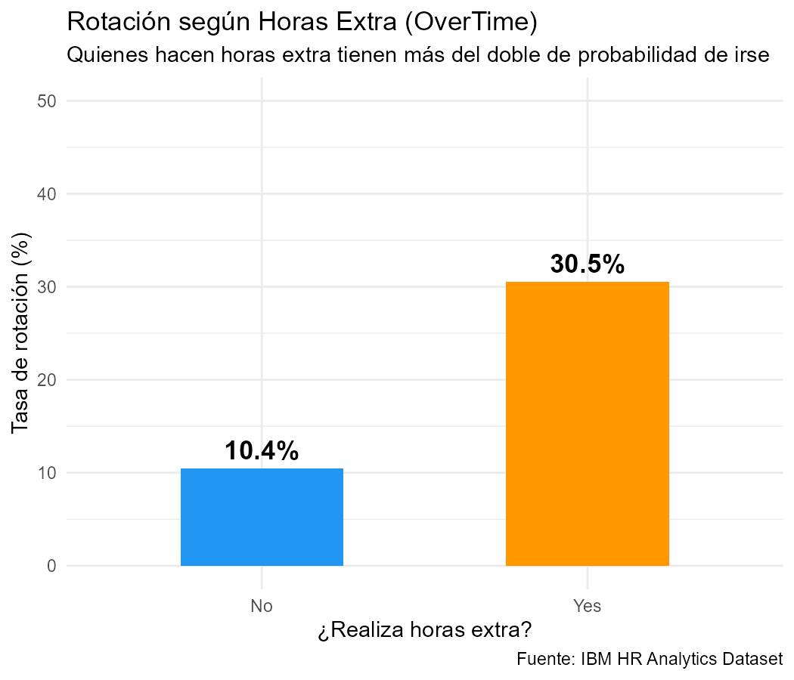
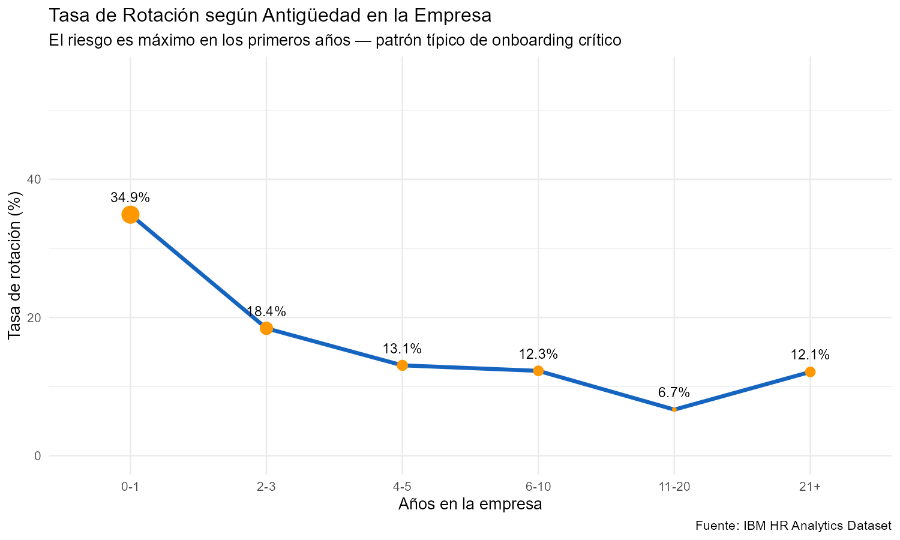
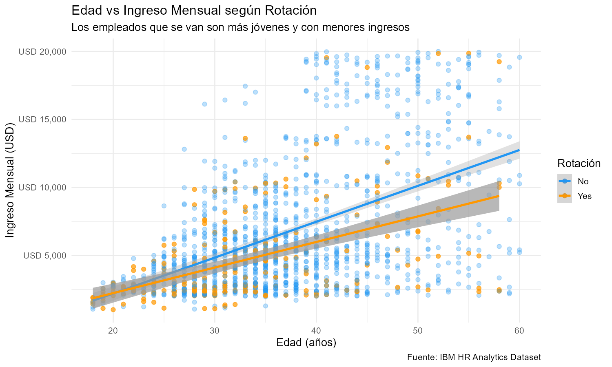
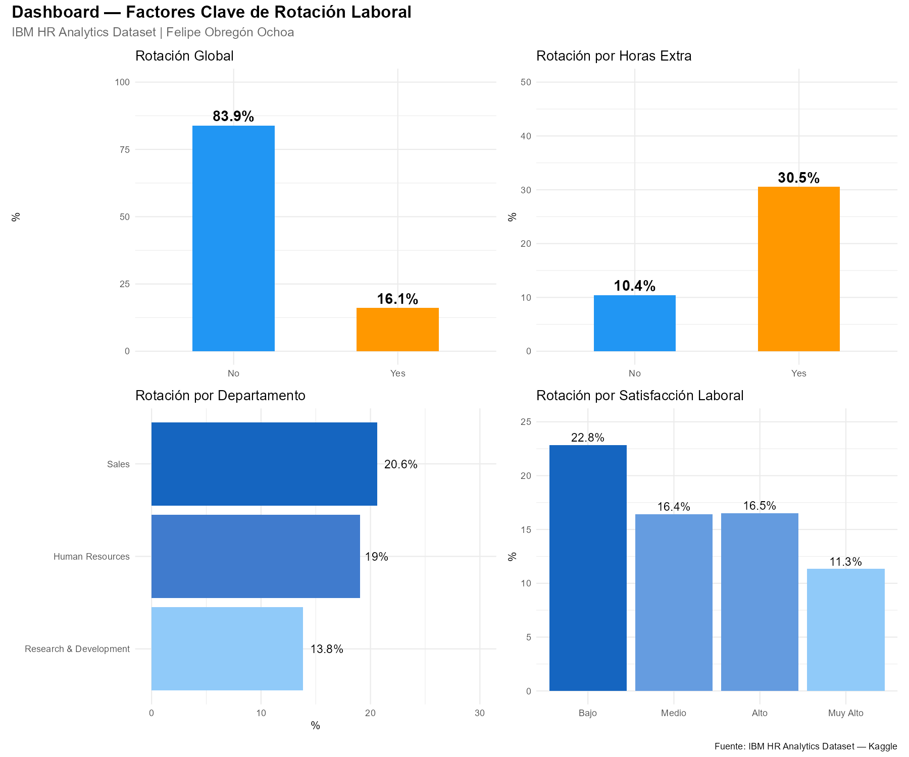

# HR-Analytics-Employee-Attrition-Performance
Análisis de rotación laboral con R | Dataset IBM HR Analytics | 
Proyecto de portafolio para RRHH analítico y Bienestar Organizacional.

## Notebooks

| Notebook | Descripción | Ver |
|---|---|---|
| 01 · EDA | Exploración inicial, limpieza y descripción | [Ver análisis](https://felipeobregon26.github.io/HR-Analytics-Employee-Attrition-Performance/notebooks/01_exploratorio.html) |
| 02 · Visualizaciones | Distribuciones, correlaciones y comparaciones | [Ver análisis](https://felipeobregon26.github.io/HR-Analytics-Employee-Attrition-Performance/notebooks/02_visualizaciones.html) |
| 03 · Modelo Predictivo | Regresión logística y Random Forest | [Ver análisis](https://felipeobregon26.github.io/HR-Analytics-Employee-Attrition-Performance/notebooks/03_modelo_predictivo.html) |
| 04 · Marco Teórico | Framework teórico y visualizaciones clave | [Ver análisis](https://felipeobregon26.github.io/HR-Analytics-Employee-Attrition-Performance/notebooks/04_marco_teorico.html) |


## Visualizaciones

### Rotación por departamento

```{r echo=FALSE, out.width='100%'}

```

### Rotación por cargo

```{r echo=FALSE, out.width='100%'}

```

### Ingreso mensual y rotación

```{r echo=FALSE, out.width='100%'}

```

### Satisfacción laboral y rotación

```{r echo=FALSE, out.width='100%'}

```

### Horas extraordinarias y rotación

```{r echo=FALSE, out.width='100%'}

```

### Antigüedad y riesgo de salida

```{r echo=FALSE, out.width='100%'}

```

### Edad e ingreso mensual

```{r echo=FALSE, out.width='100%'}

```

### Dashboard ejecutivo

```{r echo=FALSE, out.width='100%'}

``` 
